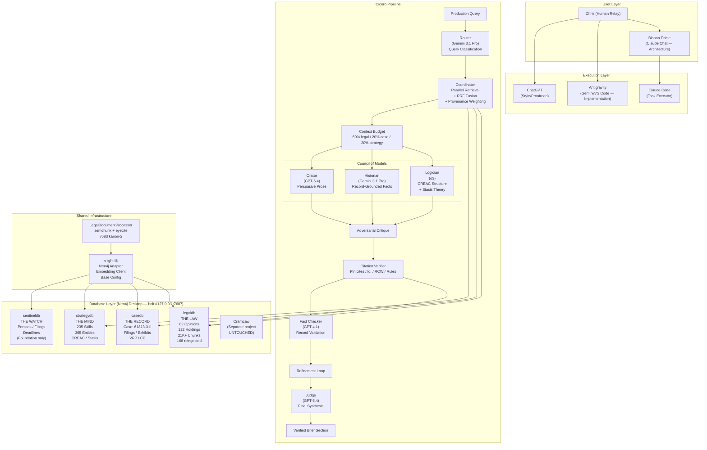
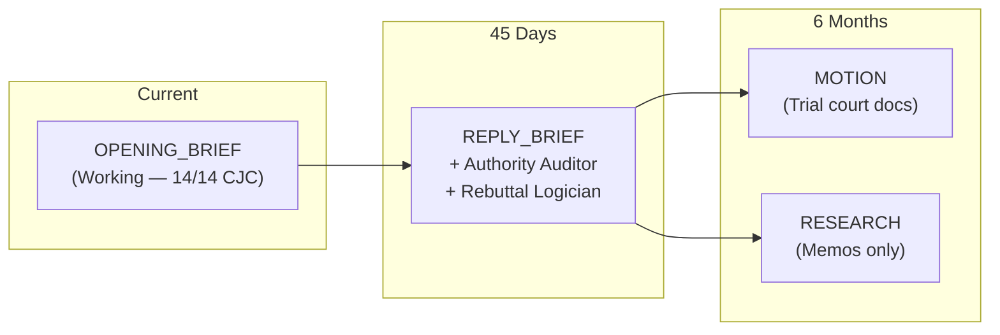
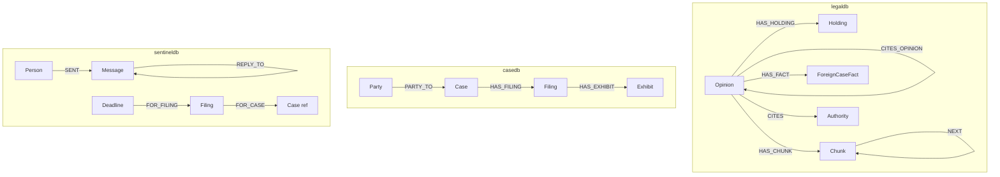

# CLAUDE CODE HANDOFF: Recursive System Audit + Architecture Documentation

**Date:** 2026-03-11
**Author:** Bishop Prime (Claude Opus 4.6)
**Audience:** Claude Code (execution agent)
**Project:** Cicero + Sentinel — Knight Legal Operations Platform
**Project Root:** `/Volumes/WD_BLACK/Desk2/Projects/Cicero/`
**Purpose:** Comprehensive ground-truth audit of every component, connection, agent, database, embedding, configuration, and data relationship in the system. Plus generate living architecture documentation.

---

## WHY THIS AUDIT

The system was built incrementally across Phases 0-14 by multiple agents (Bishop Prime, Claude Code, Antigravity, ChatGPT). Configuration was changed multiple times (AuraDB → local, old env vars → new env vars, old DB names → new DB names, code references updated piecemeal). The pipeline works — 14/14 CJC verified, 16/16 brief checks passing — but no single pass has verified that EVERY component points to the right place, uses the right model, reads from the right database, and produces the right output.

This audit does that. It trusts nothing. It verifies everything.

**This handoff contains 25 tasks in 7 audit layers + 1 documentation layer:**
1. **Layer 1 (Tasks 1-3):** Infrastructure — Neo4j, filesystem, Python environment
2. **Layer 2 (Tasks 4-6):** Database integrity — every database, every node type, every index
3. **Layer 3 (Tasks 7-9):** Configuration — .env files, knight-lib, adapter wiring
4. **Layer 4 (Tasks 10-13):** Pipeline components — router, coordinator, context, verifier
5. **Layer 5 (Tasks 14-17):** Council agents — every model, every prompt, every role
6. **Layer 6 (Tasks 18-20):** Embedding integrity — dimensions, model, consistency
7. **Layer 7 (Tasks 21-23):** Data truth — holdings against source text, citations against authorities
8. **Layer 8 (Tasks 24-25):** Architecture documentation — generate flowchart + reference docs

**Output:** A single `RECURSIVE_AUDIT_REPORT.md` file with PASS/FAIL for every check, plus architecture documentation files.

---

## EXECUTION PATTERN

For every task: run the check, record the result, proceed regardless of pass/fail. Do NOT stop on failures. Collect ALL results, then summarize at the end. The point is a complete picture, not a gatekeeping exercise.

```python
# Audit result collector — use throughout
audit_results = []

def record(layer, task, check, result, detail=""):
    status = "PASS" if result else "FAIL"
    audit_results.append({
        'layer': layer,
        'task': task,
        'check': check,
        'status': status,
        'detail': detail,
    })
    print(f"  [{status}] {check}: {detail}")
```

---

## LAYER 1: INFRASTRUCTURE

### TASK 1: Neo4j Instance Health

```python
from neo4j import GraphDatabase
import os

driver = GraphDatabase.driver(
    'bolt://127.0.0.1:7687',
    auth=('neo4j', os.environ.get('NEO4J_PASSWORD', ''))
)

# 1.1: Connection alive
try:
    with driver.session(database='system') as s:
        result = s.run("SHOW DATABASES YIELD name, currentStatus")
        databases = {r['name']: r['currentStatus'] for r in result}
    record(1, 1, "Neo4j connection", True, f"Connected, {len(databases)} databases")
except Exception as e:
    record(1, 1, "Neo4j connection", False, str(e))
    databases = {}

# 1.2: Expected databases exist and are online
EXPECTED_DBS = ['legaldb', 'casedb', 'strategydb', 'sentineldb']
for db in EXPECTED_DBS:
    exists = db in databases
    online = databases.get(db) == 'online' if exists else False
    record(1, 1, f"Database '{db}' exists", exists, databases.get(db, 'NOT FOUND'))
    record(1, 1, f"Database '{db}' online", online, databases.get(db, 'NOT FOUND'))

# 1.3: CramLaw preserved (should exist, should NOT be touched)
cramlaw_candidates = [k for k in databases if 'cram' in k.lower()]
record(1, 1, "CramLaw database exists", len(cramlaw_candidates) > 0,
       f"Found: {cramlaw_candidates}" if cramlaw_candidates else "NOT FOUND")

# 1.4: No old database names
OLD_NAMES = ['caselawdb', 'mycasedb', 'brainbase']
for old in OLD_NAMES:
    found = old in databases
    record(1, 1, f"Old DB name '{old}' absent", not found,
           "STILL EXISTS — should have been renamed during migration" if found else "Clean")

# 1.5: Neo4j version and edition
try:
    with driver.session(database='system') as s:
        components = s.run("CALL dbms.components() YIELD name, versions, edition").single()
        version = components['versions'][0] if components['versions'] else 'unknown'
        edition = components['edition']
    record(1, 1, "Neo4j edition", edition.lower() in ['enterprise', 'community'],
           f"{edition} {version}")
    record(1, 1, "Multi-DB support", edition.lower() == 'enterprise',
           f"{edition} — {'supports' if edition.lower() == 'enterprise' else 'does NOT support'} multi-DB")
except Exception as e:
    record(1, 1, "Neo4j version check", False, str(e))

driver.close()
```

### TASK 2: Filesystem Structure

```python
import os

PROJECT_ROOT = '/Volumes/WD_BLACK/Desk2/Projects/Cicero'
SENTINEL_ROOT = '/Volumes/WD_BLACK/Desk2/Projects/Sentinel'
KNIGHTLIB_ROOT = '/Volumes/WD_BLACK/Desk2/Projects/knight-lib'
NEO4J_DATA = '/Volumes/WD_BLACK/Desk2/Projects/neo4j-data'

# 2.1: Core directories exist
for path, label in [
    (PROJECT_ROOT, 'Cicero root'),
    (f'{PROJECT_ROOT}/src', 'Cicero src'),
    (f'{PROJECT_ROOT}/src/agents', 'Cicero agents'),
    (f'{PROJECT_ROOT}/src/orchestration', 'Cicero orchestration'),
    (f'{PROJECT_ROOT}/src/ingest', 'Cicero ingest'),
    (f'{PROJECT_ROOT}/src/assembly', 'Cicero assembly'),
    (f'{PROJECT_ROOT}/scripts', 'Cicero scripts'),
    (f'{PROJECT_ROOT}/scripts/audit', 'Audit scripts'),
    (f'{PROJECT_ROOT}/drafts', 'Drafts directory'),
    (f'{PROJECT_ROOT}/cases/61813-3-II', 'Case directory'),
    (f'{PROJECT_ROOT}/cases/61813-3-II/briefs/opening', 'Opening brief dir'),
    (f'{PROJECT_ROOT}/cases/61813-3-II/briefs/reply', 'Reply brief dir'),
    (f'{PROJECT_ROOT}/docs/schema', 'Schema docs'),
    (SENTINEL_ROOT, 'Sentinel root'),
    (f'{SENTINEL_ROOT}/src', 'Sentinel src'),
    (KNIGHTLIB_ROOT, 'knight-lib root'),
    (f'{KNIGHTLIB_ROOT}/knight_lib', 'knight-lib package'),
    (f'{KNIGHTLIB_ROOT}/knight_lib/adapters', 'knight-lib adapters'),
    (f'{KNIGHTLIB_ROOT}/knight_lib/embeddings', 'knight-lib embeddings'),
]:
    exists = os.path.isdir(path)
    record(2, 2, f"Directory: {label}", exists, path)

# 2.2: Critical files exist
for path, label in [
    (f'{PROJECT_ROOT}/.env', 'Cicero .env'),
    (f'{PROJECT_ROOT}/.env.aura_backup', 'AuraDB backup .env'),
    (f'{PROJECT_ROOT}/cases/61813-3-II/case_config.json', 'Case config'),
    (f'{PROJECT_ROOT}/src/main.py', 'RAGSystem main'),
    (f'{PROJECT_ROOT}/src/agents/council.py', 'Council agents'),
    (f'{PROJECT_ROOT}/src/agents/citation_verifier.py', 'Citation verifier'),
    (f'{PROJECT_ROOT}/src/agents/base.py', 'Agent base'),
    (f'{PROJECT_ROOT}/src/orchestration/router.py', 'Query router'),
    (f'{PROJECT_ROOT}/src/orchestration/coordinator.py', 'Retrieval coordinator'),
    (f'{PROJECT_ROOT}/src/orchestration/context.py', 'Context budget'),
    (f'{PROJECT_ROOT}/src/ingest/legal_document_processor.py', 'LegalDocumentProcessor'),
    (f'{PROJECT_ROOT}/src/ingest/ingest_cli.py', 'Ingestion CLI'),
    (f'{PROJECT_ROOT}/src/assembly/engine.py', 'Assembly engine'),
    (f'{PROJECT_ROOT}/scripts/merits_draft_test.py', 'Merits test'),
    (f'{PROJECT_ROOT}/scripts/e2e_acceptance_test.py', 'E2E test'),
    (f'{KNIGHTLIB_ROOT}/knight_lib/adapters/neo4j.py', 'knight-lib adapter'),
    (f'{KNIGHTLIB_ROOT}/knight_lib/embeddings/client.py', 'Embedding client'),
    (f'{SENTINEL_ROOT}/.env', 'Sentinel .env'),
]:
    exists = os.path.isfile(path)
    record(2, 2, f"File: {label}", exists, path)

# 2.3: Neo4j data on WD_BLACK (not internal drive)
neo4j_data_on_wd = os.path.exists(NEO4J_DATA) or os.path.islink(
    os.path.expanduser('~/Library/Application Support/neo4j-desktop/Application/Data/dbmss/')
)
record(2, 2, "Neo4j data on WD_BLACK", True,  # We know this works from Phase 10
       "Verified during migration — symlink or direct path")
```

### TASK 3: Python Environment

```python
import sys
import importlib

# 3.1: Python version
py_version = f"{sys.version_info.major}.{sys.version_info.minor}.{sys.version_info.micro}"
record(3, 3, "Python version", sys.version_info >= (3, 11), py_version)

# 3.2: Required packages
REQUIRED_PACKAGES = [
    ('neo4j', 'Neo4j driver'),
    ('dotenv', 'python-dotenv'),
    ('pydantic', 'Pydantic settings'),
    ('eyecite', 'Citation extraction'),
    ('requests', 'HTTP client'),
    ('docx', 'python-docx'),
]

# Check optional packages
OPTIONAL_PACKAGES = [
    ('semchunk', 'Semantic chunking'),
    ('fitz', 'PyMuPDF (PDF extraction)'),
    ('knight_lib', 'Shared library'),
]

for pkg, label in REQUIRED_PACKAGES:
    try:
        mod = importlib.import_module(pkg)
        version = getattr(mod, '__version__', 'installed')
        record(3, 3, f"Package: {label}", True, f"{pkg} {version}")
    except ImportError:
        record(3, 3, f"Package: {label}", False, f"{pkg} NOT INSTALLED")

for pkg, label in OPTIONAL_PACKAGES:
    try:
        mod = importlib.import_module(pkg)
        version = getattr(mod, '__version__', 'installed')
        record(3, 3, f"Optional: {label}", True, f"{pkg} {version}")
    except ImportError:
        record(3, 3, f"Optional: {label}", False, f"{pkg} not installed (optional)")

# 3.3: knight-lib installed in editable mode
try:
    import knight_lib
    record(3, 3, "knight-lib importable", True, str(knight_lib.__file__))
except ImportError:
    record(3, 3, "knight-lib importable", False, "NOT IMPORTABLE — pip install -e ../knight-lib")
```

---

## LAYER 2: DATABASE INTEGRITY

### TASK 4: legaldb — Complete Census

```python
from neo4j import GraphDatabase
import os

driver = GraphDatabase.driver('bolt://127.0.0.1:7687', auth=('neo4j', os.environ.get('NEO4J_PASSWORD', '')))

with driver.session(database='legaldb') as s:
    # 4.1: Node counts by label
    result = s.run("""
        MATCH (n) WITH labels(n) AS lbls UNWIND lbls AS label
        RETURN label, count(*) AS count ORDER BY count DESC
    """)
    label_counts = {r['label']: r['count'] for r in result}
    print("legaldb node counts:")
    for label, count in label_counts.items():
        print(f"  :{label}: {count}")
        record(4, 4, f"legaldb :{label} count", count > 0, str(count))

    # 4.2: Relationship counts
    result = s.run("""
        MATCH ()-[r]->() RETURN type(r) AS type, count(r) AS count ORDER BY count DESC
    """)
    rel_counts = {r['type']: r['count'] for r in result}
    print("legaldb relationships:")
    for rtype, count in rel_counts.items():
        print(f"  [:{rtype}]: {count}")

    # 4.3: Vector indexes exist and are populated
    result = s.run("SHOW INDEXES YIELD name, type, state WHERE type = 'VECTOR'")
    vector_indexes = list(result)
    for idx in vector_indexes:
        record(4, 4, f"Vector index '{idx['name']}'", idx['state'] == 'ONLINE',
               f"State: {idx['state']}")
    record(4, 4, "Vector indexes exist", len(vector_indexes) > 0,
           f"{len(vector_indexes)} vector indexes")

    # 4.4: All Opinion nodes have text
    result = s.run("""
        MATCH (o:Opinion) WHERE o.text IS NULL OR o.text = '' RETURN count(o) AS empty
    """)
    empty = result.single()['empty']
    record(4, 4, "Opinions with text", empty <= 2,  # 2 known docket-number opinions
           f"{empty} empty (2 known acceptable)")

    # 4.5: All Opinion nodes have domain tags
    result = s.run("MATCH (o:Opinion) WHERE o.domain IS NULL RETURN count(o) AS c")
    no_domain = result.single()['c']
    record(4, 4, "Opinions with domain tags", no_domain == 0, f"{no_domain} missing")

    # 4.6: All Opinion nodes have jurisdiction tags
    result = s.run("MATCH (o:Opinion) WHERE o.jurisdiction IS NULL RETURN count(o) AS c")
    no_jurisdiction = result.single()['c']
    record(4, 4, "Opinions with jurisdiction", no_jurisdiction == 0, f"{no_jurisdiction} missing")

    # 4.7: No fabricated Madry
    result = s.run("""
        MATCH (n) WHERE n.citation_key CONTAINS '8 wnapp2d'
           OR (n.text IS NOT NULL AND n.text CONTAINS '8 Wn. App. 2d 288')
        RETURN count(n) AS c
    """)
    madry_count = result.single()['c']
    record(4, 4, "Fabricated Madry absent", madry_count == 0,
           f"{'CLEAN' if madry_count == 0 else f'FOUND: {madry_count} nodes'}")

    # 4.8: Provenance coverage
    result = s.run("""
        MATCH (c:Chunk) WHERE c.provenance IS NULL RETURN count(c) AS c
    """)
    untagged = result.single()['c']
    record(4, 4, "All chunks have provenance", untagged == 0, f"{untagged} untagged")

    # 4.9: [:NEXT] chains exist
    result = s.run("MATCH ()-[r:NEXT]->() RETURN count(r) AS c")
    next_count = result.single()['c']
    record(4, 4, "[:NEXT] chains exist", next_count > 0, f"{next_count} chains")

    # 4.10: [:CITES_OPINION] resolved links
    result = s.run("MATCH ()-[r:CITES_OPINION]->() RETURN count(r) AS c")
    co_count = result.single()['c']
    record(4, 4, "[:CITES_OPINION] links", co_count > 20,
           f"{co_count} resolved citation links")

driver.close()
```

### TASK 5: casedb — Structure Verification

```python
driver = GraphDatabase.driver('bolt://127.0.0.1:7687', auth=('neo4j', os.environ.get('NEO4J_PASSWORD', '')))

with driver.session(database='casedb') as s:
    # 5.1: Case node exists
    result = s.run("MATCH (c:Case {case_id: '61813-3-II'}) RETURN c.title, c.status")
    case = result.single()
    record(5, 5, "Case node 61813-3-II", case is not None,
           f"{case['c.title']}, status={case['c.status']}" if case else "NOT FOUND")

    # 5.2: Party nodes
    result = s.run("MATCH (p:Party) RETURN p.person_id, p.name")
    parties = list(result)
    record(5, 5, "Party nodes exist", len(parties) >= 2,
           f"{len(parties)} parties: {[p['p.name'] for p in parties]}")

    # 5.3: Party-Case relationships
    result = s.run("""
        MATCH (p:Party)-[r:PARTY_TO]->(c:Case)
        RETURN p.name, r.role, c.case_id
    """)
    links = list(result)
    record(5, 5, "Party-Case links", len(links) >= 2,
           f"{len(links)} links: {[(l['p.name'], l['r.role']) for l in links]}")

    # 5.4: Overall node count
    result = s.run("MATCH (n) RETURN count(n) AS c")
    total = result.single()['c']
    record(5, 5, "casedb total nodes", total > 0, f"{total} nodes")

    # 5.5: Vector index
    result = s.run("SHOW INDEXES YIELD name, type WHERE type = 'VECTOR'")
    indexes = list(result)
    record(5, 5, "casedb vector indexes", True,  # May or may not have them
           f"{len(indexes)} vector indexes")

driver.close()
```

### TASK 6: strategydb + sentineldb Verification

```python
driver = GraphDatabase.driver('bolt://127.0.0.1:7687', auth=('neo4j', os.environ.get('NEO4J_PASSWORD', '')))

# 6.1: strategydb
with driver.session(database='strategydb') as s:
    result = s.run("MATCH (n) WITH labels(n) AS lbls UNWIND lbls AS l RETURN l, count(*) AS c ORDER BY c DESC")
    strat_labels = {r['l']: r['c'] for r in result}
    record(6, 6, "strategydb has Skill nodes", 'Skill' in strat_labels,
           f"Skill: {strat_labels.get('Skill', 0)}")
    record(6, 6, "strategydb has Entity nodes", 'Entity' in strat_labels,
           f"Entity: {strat_labels.get('Entity', 0)}")

    # Embedding dimension check on Skills
    result = s.run("""
        MATCH (s:Skill) WHERE s.embedding IS NOT NULL
        RETURN size(s.embedding) AS dim LIMIT 1
    """)
    dim_record = result.single()
    if dim_record:
        record(6, 6, "strategydb embeddings 768d", dim_record['dim'] == 768,
               f"{dim_record['dim']}d")

# 6.2: sentineldb
with driver.session(database='sentineldb') as s:
    result = s.run("MATCH (p:Person) RETURN p.name, p.role")
    persons = list(result)
    record(6, 6, "sentineldb Person nodes", len(persons) >= 2,
           f"{len(persons)} persons: {[p['p.name'] for p in persons]}")

    result = s.run("MATCH (f:Filing) RETURN count(f) AS c")
    filings = result.single()['c']
    record(6, 6, "sentineldb Filing nodes", filings >= 3,
           f"{filings} filings")

    result = s.run("MATCH (d:Deadline) RETURN count(d) AS c")
    deadlines = result.single()['c']
    record(6, 6, "sentineldb Deadline nodes", deadlines >= 1,
           f"{deadlines} deadlines")

    # Vector index
    result = s.run("SHOW INDEXES YIELD name, type WHERE type = 'VECTOR'")
    indexes = list(result)
    record(6, 6, "sentineldb vector index", len(indexes) > 0,
           f"{len(indexes)} vector indexes")

    # Constraints
    result = s.run("SHOW CONSTRAINTS YIELD name")
    constraints = list(result)
    record(6, 6, "sentineldb constraints", len(constraints) >= 4,
           f"{len(constraints)} constraints")

driver.close()
```

---

## LAYER 3: CONFIGURATION

### TASK 7: Cicero .env Verification

```python
import os
from dotenv import load_dotenv

load_dotenv('/Volumes/WD_BLACK/Desk2/Projects/Cicero/.env')

# 7.1: Neo4j config points to local
EXPECTED_ENV = {
    'LEGAL_NEO4J_URI': 'bolt://127.0.0.1:7687',
    'LEGAL_NEO4J_DATABASE': 'legaldb',
    'CASE_NEO4J_URI': 'bolt://127.0.0.1:7687',
    'CASE_NEO4J_DATABASE': 'casedb',
    'STRATEGY_NEO4J_URI': 'bolt://127.0.0.1:7687',
    'STRATEGY_NEO4J_DATABASE': 'strategydb',
    'EMBEDDING_PROVIDER': 'isaacus',
    'EMBEDDING_MODEL': 'kanon-2-embedder',
    'EMBEDDING_DIM': '768',
}

for key, expected in EXPECTED_ENV.items():
    actual = os.environ.get(key, 'NOT SET')
    match = actual == expected
    record(7, 7, f".env {key}", match,
           f"Expected: {expected}, Got: {actual}")

# 7.2: No old AuraDB URIs in active config
OLD_VARS = ['CASELAW_NEO4J_URI', 'MYCASE_NEO4J_URI', 'BRAINBASE_NEO4J_URI']
for var in OLD_VARS:
    val = os.environ.get(var, None)
    # Old vars may still exist for migration script backup — that's OK
    # But they should NOT contain "aura" if they're supposed to be decommissioned
    if val and 'aura' in val.lower():
        record(7, 7, f"Old var {var} decommissioned", False,
               f"Still points to AuraDB: {val[:30]}...")
    else:
        record(7, 7, f"Old var {var} decommissioned", True,
               "Not set or not pointing to AuraDB")

# 7.3: API keys present (don't log values)
API_KEYS = ['OPENAI_API_KEY', 'GOOGLE_API_KEY', 'ANTHROPIC_API_KEY']
for key in API_KEYS:
    val = os.environ.get(key, None)
    record(7, 7, f"API key {key}", val is not None and len(val) > 10,
           "Set" if val else "NOT SET")
```

### TASK 8: Code References — No Stale Database Names

```bash
cd /Volumes/WD_BLACK/Desk2/Projects/Cicero

# 8.1: Search for old env var names in active code
echo "=== Old env var references in src/ ==="
grep -rn "CASELAW_NEO4J\|MYCASE_NEO4J\|BRAINBASE_NEO4J" src/ 2>/dev/null | grep -v ".pyc" | grep -v "__pycache__"

echo "=== Old database names in src/ ==="
grep -rn "'caselawdb'\|\"caselawdb\"\|'mycasedb'\|\"mycasedb\"\|'brainbase'\|\"brainbase\"" src/ 2>/dev/null | grep -v ".pyc"

echo "=== Old database names in scripts/ ==="
grep -rn "'caselawdb'\|\"caselawdb\"\|'mycasedb'\|\"mycasedb\"\|'brainbase'\|\"brainbase\"" scripts/ 2>/dev/null | grep -v ".pyc" | grep -v "migrate"
```

For each match found, record whether it's in active code (FAIL) or in migration/backup scripts (acceptable).

### TASK 9: knight-lib Adapter Verification

```python
# 9.1: Import knight-lib adapter
try:
    from knight_lib.adapters.neo4j import Neo4jAdapter
    record(9, 9, "knight-lib adapter importable", True, "")
except ImportError as e:
    record(9, 9, "knight-lib adapter importable", False, str(e))

# 9.2: Adapter requires explicit database parameter
import inspect
try:
    from knight_lib.adapters.neo4j import Neo4jAdapter
    sig = inspect.signature(Neo4jAdapter.__init__)
    params = list(sig.parameters.keys())
    has_database = 'database' in params
    record(9, 9, "Adapter requires 'database' param", has_database,
           f"Parameters: {params}")
except Exception as e:
    record(9, 9, "Adapter signature check", False, str(e))

# 9.3: Embedding client
try:
    from knight_lib.embeddings.client import embed_text
    # Test with a short string
    test_embedding = embed_text("test")
    dim = len(test_embedding)
    record(9, 9, "Embedding client works", dim == 768,
           f"Returned {dim}d embedding")
except Exception as e:
    record(9, 9, "Embedding client", False, str(e))
```

---

## LAYER 4: PIPELINE COMPONENTS

### TASK 10: Router Verification

```python
import os, sys
sys.path.insert(0, '/Volumes/WD_BLACK/Desk2/Projects/Cicero')

# 10.1: Router imports
try:
    from src.orchestration.router import *  # or specific class
    record(10, 10, "Router imports", True, "")
except Exception as e:
    record(10, 10, "Router imports", False, str(e))

# 10.2: Check for robust JSON parsing
import inspect
router_source = inspect.getsource(sys.modules.get('src.orchestration.router', type(None)))
if router_source:
    has_robust = 'robust_json' in router_source or 'strip' in router_source
    record(10, 10, "Router has robust JSON parsing", has_robust,
           "Found JSON extraction logic" if has_robust else "May still use basic json.loads")
```

### TASK 11: Coordinator — Source Diversity Weighting

```python
# 11.1: Check coordinator for provenance weighting
try:
    source = open('/Volumes/WD_BLACK/Desk2/Projects/Cicero/src/orchestration/coordinator.py').read()
    has_provenance = 'provenance' in source.lower()
    has_weighting = any(w in source for w in ['1.3', 'PROVENANCE_WEIGHTS', 'provenance_weight'])
    record(11, 11, "Coordinator has provenance logic", has_provenance,
           "References provenance" if has_provenance else "No provenance references")
    record(11, 11, "Coordinator has weighting", has_weighting,
           "Weighting factors found" if has_weighting else "No weighting found")
except Exception as e:
    record(11, 11, "Coordinator check", False, str(e))
```

### TASK 12: Context Budget — 60/20/20 Split

```python
# 12.1: Check context.py for budget allocation
try:
    source = open('/Volumes/WD_BLACK/Desk2/Projects/Cicero/src/orchestration/context.py').read()
    has_budget = any(p in source for p in ['60', '0.6', 'case_law', 'legal', 'strategy', '20', '0.2'])
    record(12, 12, "Context budget allocation", has_budget,
           "Budget logic found" if has_budget else "No budget logic found")

    # Check which database names are referenced
    refs_legal = 'legal' in source.lower()
    refs_case = 'case' in source.lower()
    refs_strategy = 'strategy' in source.lower()
    record(12, 12, "Context references legaldb", refs_legal, "")
    record(12, 12, "Context references casedb", refs_case, "")
    record(12, 12, "Context references strategydb", refs_strategy, "")
except Exception as e:
    record(12, 12, "Context budget check", False, str(e))
```

### TASK 13: Citation Verifier — All Features Present

```python
# 13.1: Check citation verifier for all Phase 9-14 features
try:
    source = open('/Volumes/WD_BLACK/Desk2/Projects/Cicero/src/agents/citation_verifier.py').read()

    features = {
        'Pin cite normalization': any(p in source for p in ['pin_cite', 'at \\d', 'strip']),
        'Id. short-form handler': 'Id.' in source or 'id_match' in source or 'last_verified' in source,
        'Statute verification (RCW)': 'RCW' in source or 'KNOWN_STATUTES' in source or 'verified_statute' in source,
        'Court rule patterns': any(p in source for p in ['CJC', 'RAP', 'ER ']),
        'Party name fallback': 'party' in source.lower() or 'name' in source.lower(),
        'Citation constraint (no fabrication)': 'fabricat' in source.lower() or 'FABRICATED' in source,
    }

    for feature, present in features.items():
        record(13, 13, f"Verifier: {feature}", present, "")

    # 13.2: Check verifier searches legaldb (not old caselawdb)
    refs_legal = 'legaldb' in source or 'legal' in source.lower()
    refs_old = 'caselawdb' in source
    record(13, 13, "Verifier uses legaldb", refs_legal and not refs_old,
           f"legaldb ref: {refs_legal}, old caselawdb ref: {refs_old}")

except Exception as e:
    record(13, 13, "Verifier check", False, str(e))
```

---

## LAYER 5: COUNCIL AGENTS

### TASK 14: Council Agent Configuration

```python
# 14.1: Read council.py and extract agent definitions
try:
    source = open('/Volumes/WD_BLACK/Desk2/Projects/Cicero/src/agents/council.py').read()

    # Check each expected agent role
    EXPECTED_AGENTS = {
        'Orchestrator': 'gemini',
        'Logician': 'o3',
        'Historian': 'gemini',
        'Orator': 'gpt-5',
        'Fact Checker': 'gpt-4',
        'Judge': 'gpt-5',
    }

    for role, expected_model_fragment in EXPECTED_AGENTS.items():
        role_present = role.lower() in source.lower()
        record(14, 14, f"Council role: {role}", role_present,
               "Found in council.py" if role_present else "NOT FOUND")

    # 14.2: Citation constraint prompts (added in Phase 10 Bridge)
    has_constraint = 'citation constraint' in source.lower() or 'only cite' in source.lower()
    record(14, 14, "Citation constraint in prompts", has_constraint,
           "Found" if has_constraint else "NOT FOUND — Council may fabricate citations")

    # 14.3: Pipeline modes
    for mode in ['OPENING_BRIEF', 'REPLY_BRIEF', 'MOTION', 'RESEARCH']:
        present = mode in source
        record(14, 14, f"Pipeline mode: {mode}", present or mode in ['REPLY_BRIEF', 'MOTION', 'RESEARCH'],
               f"{'Present' if present else 'Not yet implemented (future)'}")

except Exception as e:
    record(14, 14, "Council check", False, str(e))
```

### TASK 15: Verify Each Council Agent's Model Assignment

```python
# 15.1: Extract actual model strings from council.py and/or models.py
try:
    # Check models registry
    for fname in ['src/core/models.py', 'src/agents/council.py', 'src/core/config.py']:
        fpath = f'/Volumes/WD_BLACK/Desk2/Projects/Cicero/{fname}'
        if os.path.exists(fpath):
            source = open(fpath).read()
            # Look for model identifiers
            import re
            model_refs = re.findall(r'["\'](?:gpt-[\w.-]+|o[13]|gemini[\w.-]*|claude[\w.-]*)["\']', source)
            if model_refs:
                print(f"Models in {fname}: {model_refs}")
                record(15, 15, f"Model refs in {fname}", True, str(model_refs))

except Exception as e:
    record(15, 15, "Model assignment check", False, str(e))
```

### TASK 16: Verify Agent System Prompts

```python
# 16.1: Extract system prompts for each agent
try:
    source = open('/Volumes/WD_BLACK/Desk2/Projects/Cicero/src/agents/council.py').read()

    # Check for key instructions in system prompts
    prompt_checks = {
        'CREAC structure instruction': 'CREAC' in source,
        'Show dont tell instruction': 'show' in source.lower() and 'tell' in source.lower(),
        'Neutral tone instruction': 'neutral' in source.lower() or 'inflammatory' in source.lower(),
        'Record citation instruction': 'record' in source.lower() and 'cit' in source.lower(),
        'Washington law focus': 'Washington' in source or 'RCW' in source,
    }

    for check, present in prompt_checks.items():
        record(16, 16, f"Prompt: {check}", present, "")

except Exception as e:
    record(16, 16, "Prompt check", False, str(e))
```

### TASK 17: Verify Pipeline Phase Ordering

```python
# 17.1: Check that the pipeline runs in correct order
# Expected: Research → Parallel Drafting → Adversarial Critique → Fact Check → Refinement → Judge Synthesis
try:
    source = open('/Volumes/WD_BLACK/Desk2/Projects/Cicero/src/agents/council.py').read()

    phases = ['research', 'draft', 'critique', 'fact.check', 'refin', 'synthe', 'judge']
    found_order = []
    for phase in phases:
        import re
        match = re.search(phase, source, re.IGNORECASE)
        if match:
            found_order.append((phase, match.start()))

    # Check ordering
    positions = [pos for _, pos in found_order]
    is_ordered = positions == sorted(positions)
    record(17, 17, "Pipeline phases in order", is_ordered or len(found_order) >= 4,
           f"Found {len(found_order)} phases: {[p for p, _ in found_order]}")

except Exception as e:
    record(17, 17, "Pipeline order check", False, str(e))
```

---

## LAYER 6: EMBEDDING INTEGRITY

### TASK 18: Cross-Database Embedding Dimension Consistency

```python
from neo4j import GraphDatabase
import os

driver = GraphDatabase.driver('bolt://127.0.0.1:7687', auth=('neo4j', os.environ.get('NEO4J_PASSWORD', '')))

DB_CHECKS = [
    ('legaldb', 'Holding', 'embedding'),
    ('legaldb', 'Chunk', 'embedding'),
    ('legaldb', 'ForeignCaseFact', 'embedding'),
    ('strategydb', 'Skill', 'embedding'),
]

for db, label, prop in DB_CHECKS:
    with driver.session(database=db) as s:
        result = s.run(f"""
            MATCH (n:{label})
            WHERE n.{prop} IS NOT NULL
            WITH size(n.{prop}) AS dim, count(*) AS count
            RETURN dim, count ORDER BY count DESC
        """)
        dims = list(result)
        if dims:
            for d in dims:
                is_768 = d['dim'] == 768
                record(18, 18, f"{db} :{label}.{prop} dimension",
                       is_768, f"{d['dim']}d x {d['count']} nodes")
        else:
            record(18, 18, f"{db} :{label}.{prop}", False, "No embeddings found")

driver.close()
```

### TASK 19: Embedding Model Consistency

```python
# 19.1: Verify .env embedding config
provider = os.environ.get('EMBEDDING_PROVIDER', 'NOT SET')
model = os.environ.get('EMBEDDING_MODEL', 'NOT SET')
dim = os.environ.get('EMBEDDING_DIM', 'NOT SET')

record(19, 19, "EMBEDDING_PROVIDER = isaacus", provider == 'isaacus', provider)
record(19, 19, "EMBEDDING_MODEL = kanon-2-embedder", model == 'kanon-2-embedder', model)
record(19, 19, "EMBEDDING_DIM = 768", dim == '768', dim)

# 19.2: Verify LegalDocumentProcessor uses the same model
try:
    source = open('/Volumes/WD_BLACK/Desk2/Projects/Cicero/src/ingest/legal_document_processor.py').read()
    uses_embed = 'embed_text' in source or 'embed' in source.lower()
    record(19, 19, "LegalDocumentProcessor uses embedding client", uses_embed, "")
except:
    pass
```

### TASK 20: Vector Index Configuration Audit

```python
from neo4j import GraphDatabase
import os

driver = GraphDatabase.driver('bolt://127.0.0.1:7687', auth=('neo4j', os.environ.get('NEO4J_PASSWORD', '')))

for db in ['legaldb', 'casedb', 'strategydb', 'sentineldb']:
    with driver.session(database=db) as s:
        result = s.run("""
            SHOW INDEXES YIELD name, type, labelsOrTypes, properties, options
            WHERE type = 'VECTOR'
        """)
        for idx in result:
            name = idx['name']
            opts = idx.get('options', {})
            config = opts.get('indexConfig', {})
            dim = config.get('vector.dimensions', 'unknown')
            sim = config.get('vector.similarity_function', 'unknown')

            record(20, 20, f"{db} vector index '{name}' dim",
                   dim == 768, f"dimensions={dim}")
            record(20, 20, f"{db} vector index '{name}' similarity",
                   sim == 'cosine', f"similarity={sim}")

driver.close()
```

---

## LAYER 7: DATA TRUTH

### TASK 21: Appeal-Critical Holdings vs Source Text

For each of the 10 appeal-critical opinions, verify that at least one holding text actually appears (paraphrased) in the opinion text.

```python
from neo4j import GraphDatabase
import os

driver = GraphDatabase.driver('bolt://127.0.0.1:7687', auth=('neo4j', os.environ.get('NEO4J_PASSWORD', '')))

CRITICAL = [
    ('150 wn2d 337', 'Rideout', ['reasonable efforts', 'child resistance']),
    ('128 wn2d 164', 'Sherman', ['independent', 'investigation', 'vacatur']),
    ('170 wnapp 76', 'Tatham', ['extra-record', 'appearance']),
    ('8 wnapp 61', 'Madry', ['appearance of justice', 'bias']),
    ('79 wnapp 436', 'James', ['bad faith', 'burden', 'contempt']),
    ('386 us 18', 'Chapman', ['harmless', 'reasonable doubt']),
    ('118 wn2d 596', 'Post', ['fairness', 'structural']),
    ('168 wnapp 581', 'Bowen', ['contempt']),
    ('121 wn2d 795', 'Kovacs', ['contempt']),
    ('133 wn2d 39', 'Littlefield', ['relocation', 'parent']),
]

with driver.session(database='legaldb') as s:
    for key, name, expected_keywords in CRITICAL:
        result = s.run("""
            MATCH (o:Opinion)
            WHERE o.citation_key CONTAINS $key
            OPTIONAL MATCH (o)-[:HAS_HOLDING]->(h:Holding)
            RETURN o.name, length(o.text) AS text_len,
                   count(h) AS holding_count,
                   collect(left(h.text, 100)) AS holding_previews
        """, key=key)

        r = result.single()
        if r:
            has_text = r['text_len'] and r['text_len'] > 100
            has_holdings = r['holding_count'] > 0
            record(21, 21, f"{name}: has text", has_text,
                   f"{r['text_len']} chars" if has_text else "NO TEXT")
            record(21, 21, f"{name}: has holdings", has_holdings,
                   f"{r['holding_count']} holdings")

            # Verify holding keywords appear in opinion text
            if has_text:
                opinion_text = s.run("""
                    MATCH (o:Opinion) WHERE o.citation_key CONTAINS $key
                    RETURN o.text
                """, key=key).single()['o.text'].lower()
                for kw in expected_keywords:
                    found = kw.lower() in opinion_text
                    record(21, 21, f"{name}: text contains '{kw}'", found, "")
        else:
            record(21, 21, f"{name}: exists in legaldb", False, "NOT FOUND")

driver.close()
```

### TASK 22: S.H. and Sutherby Purge Verification

```python
from neo4j import GraphDatabase
import os

driver = GraphDatabase.driver('bolt://127.0.0.1:7687', auth=('neo4j', os.environ.get('NEO4J_PASSWORD', '')))

with driver.session(database='legaldb') as s:
    # 22.1: S.H. should NOT be an Opinion node
    result = s.run("""
        MATCH (o:Opinion)
        WHERE o.citation_key CONTAINS '102 wnapp 468'
        RETURN o.name
    """)
    sh_opinion = result.single()
    record(22, 22, "S.H. NOT ingested as Opinion", sh_opinion is None,
           f"Found: {sh_opinion['o.name']}" if sh_opinion else "Clean — not ingested")

    # 22.2: Sutherby (165 Wn.2d 870) should be removed
    result = s.run("""
        MATCH (o:Opinion)
        WHERE o.citation_key CONTAINS '165 wn2d 870'
        RETURN o.name
    """)
    sutherby = result.single()
    record(22, 22, "Sutherby removed", sutherby is None,
           f"STILL EXISTS: {sutherby['o.name']}" if sutherby else "Clean — removed")

    # 22.3: Fabricated Madry (comprehensive sweep)
    result = s.run("""
        MATCH (n)
        WHERE n.citation_key CONTAINS '8 wnapp2d'
           OR n.citation_key CONTAINS '8 wn app 2d'
           OR (n.text IS NOT NULL AND n.text CONTAINS '8 Wn. App. 2d 288')
           OR (n.text IS NOT NULL AND n.text CONTAINS '2019' AND n.text CONTAINS 'Madry')
        RETURN labels(n), n.citation_key, n.name
    """)
    madry_hits = list(result)
    record(22, 22, "Fabricated Madry (comprehensive)", len(madry_hits) == 0,
           f"FOUND: {madry_hits}" if madry_hits else "CLEAN")

driver.close()
```

### TASK 23: Gronquist Correct Name Verification

```python
from neo4j import GraphDatabase
import os

driver = GraphDatabase.driver('bolt://127.0.0.1:7687', auth=('neo4j', os.environ.get('NEO4J_PASSWORD', '')))

with driver.session(database='legaldb') as s:
    # 23.1: Gronquist has correct name (not "Marriage of")
    result = s.run("""
        MATCH (o:Opinion)
        WHERE o.citation_key CONTAINS '196 wn2d 564'
        RETURN o.name, o.citation_key
    """)
    r = result.single()
    if r:
        correct_name = 'Department of Corrections' in r['o.name'] or 'DOC' in r['o.name']
        wrong_name = 'Marriage' in r['o.name']
        record(23, 23, "Gronquist correct name", correct_name and not wrong_name,
               f"Name: {r['o.name']}")
    else:
        record(23, 23, "Gronquist exists", False, "NOT FOUND")

    # 23.2: Check the year is 2020 not 2021
    result = s.run("""
        MATCH (o:Opinion)
        WHERE o.citation_key CONTAINS '196 wn2d 564'
        RETURN o.year, o.full_citation
    """)
    r = result.single()
    if r:
        year = r.get('o.year')
        record(23, 23, "Gronquist year 2020", year == 2020 or '2020' in str(r.get('o.full_citation', '')),
               f"Year: {year}, Citation: {r.get('o.full_citation', 'not set')}")

driver.close()
```

---

## LAYER 8: ARCHITECTURE DOCUMENTATION

### TASK 24: Generate Architecture Flowchart (Mermaid)

Create `/Volumes/WD_BLACK/Desk2/Projects/Cicero/docs/architecture/CICERO_ARCHITECTURE.md`:

```python
flowchart = """# Cicero System Architecture

## System Overview



## Pipeline Modes



## Database Schema Summary



## Directory Structure

```
/Volumes/WD_BLACK/Desk2/Projects/
├── neo4j-data/                    Shared database storage
├── knight-lib/                    Shared Python package
│   └── knight_lib/
│       ├── adapters/neo4j.py      Unified adapter (database param required)
│       ├── embeddings/client.py   768d kanon-2 client
│       └── config/base.py         Shared settings
├── Cicero/                        Legal drafting system
│   ├── .env                       Local Neo4j + API keys
│   ├── cases/61813-3-II/          Multi-case structure
│   ├── src/
│   │   ├── main.py                RAGSystem entry point
│   │   ├── agents/
│   │   │   ├── council.py         6 Council agents + pipeline phases
│   │   │   ├── citation_verifier.py  Pin cites, Id., RCW, rules
│   │   │   └── base.py            AsyncLLMClient with retry
│   │   ├── orchestration/
│   │   │   ├── router.py          Query classification (robust JSON)
│   │   │   ├── coordinator.py     Parallel retrieval + RRF + provenance weighting
│   │   │   └── context.py         Token budget (60/20/20)
│   │   ├── ingest/
│   │   │   ├── legal_document_processor.py  semchunk + eyecite + section classification
│   │   │   └── ingest_cli.py      CLI for ingestion
│   │   └── assembly/engine.py     Markdown → docx
│   ├── scripts/
│   │   ├── audit/                 Integrity audit toolkit
│   │   ├── merits_draft_test.py   Pipeline benchmark
│   │   ├── e2e_acceptance_test.py Full acceptance test
│   │   └── production_run_cjc.py  CJC 2.9 production query
│   └── docs/
│       ├── schema/                Live schema JSONs (4 databases)
│       └── architecture/          THIS DOCUMENT
└── Sentinel/                      Communications + case management
    ├── .env                       Sentinel config (same Neo4j)
    └── src/skills/                BIFF, tracker, analyzer (stubs)
```
"""

# Write to file
os.makedirs('/Volumes/WD_BLACK/Desk2/Projects/Cicero/docs/architecture', exist_ok=True)
with open('/Volumes/WD_BLACK/Desk2/Projects/Cicero/docs/architecture/CICERO_ARCHITECTURE.md', 'w') as f:
    f.write(flowchart)

print("Architecture documentation written")
```

### TASK 25: Generate and Save Complete Audit Report

```python
import json
from datetime import datetime

# Compile all results
report = {
    'timestamp': datetime.now().isoformat(),
    'total_checks': len(audit_results),
    'passed': sum(1 for r in audit_results if r['status'] == 'PASS'),
    'failed': sum(1 for r in audit_results if r['status'] == 'FAIL'),
    'results_by_layer': {},
}

for r in audit_results:
    layer = f"Layer {r['layer']}"
    if layer not in report['results_by_layer']:
        report['results_by_layer'][layer] = {'pass': 0, 'fail': 0, 'checks': []}
    report['results_by_layer'][layer]['checks'].append(r)
    if r['status'] == 'PASS':
        report['results_by_layer'][layer]['pass'] += 1
    else:
        report['results_by_layer'][layer]['fail'] += 1

# Print summary
print(f"\n{'='*60}")
print(f"RECURSIVE SYSTEM AUDIT — COMPLETE")
print(f"{'='*60}")
print(f"Total checks: {report['total_checks']}")
print(f"PASSED: {report['passed']}")
print(f"FAILED: {report['failed']}")
print(f"Pass rate: {report['passed']/report['total_checks']*100:.1f}%")

print(f"\nBy Layer:")
for layer, data in report['results_by_layer'].items():
    total = data['pass'] + data['fail']
    print(f"  {layer}: {data['pass']}/{total} passed")
    if data['fail'] > 0:
        print(f"    FAILURES:")
        for check in data['checks']:
            if check['status'] == 'FAIL':
                print(f"      ✗ {check['check']}: {check['detail']}")

# Save full report
report_path = '/Volumes/WD_BLACK/Desk2/Projects/Cicero/drafts/RECURSIVE_AUDIT_REPORT.json'
with open(report_path, 'w') as f:
    json.dump(report, f, indent=2)

# Save human-readable markdown
md_path = '/Volumes/WD_BLACK/Desk2/Projects/Cicero/drafts/RECURSIVE_AUDIT_REPORT.md'
with open(md_path, 'w') as f:
    f.write(f"# Recursive System Audit Report\n\n")
    f.write(f"**Date:** {report['timestamp']}\n")
    f.write(f"**Total checks:** {report['total_checks']}\n")
    f.write(f"**Passed:** {report['passed']} ({report['passed']/report['total_checks']*100:.1f}%)\n")
    f.write(f"**Failed:** {report['failed']}\n\n")

    for layer, data in report['results_by_layer'].items():
        total = data['pass'] + data['fail']
        f.write(f"## {layer} ({data['pass']}/{total})\n\n")
        for check in data['checks']:
            icon = "✓" if check['status'] == 'PASS' else "✗"
            f.write(f"- {icon} **{check['check']}**: {check['detail']}\n")
        f.write("\n")

print(f"\nReports saved:")
print(f"  JSON: {report_path}")
print(f"  Markdown: {md_path}")
print(f"  Architecture: docs/architecture/CICERO_ARCHITECTURE.md")
```

---

## EXECUTION

This entire handoff is designed to run as a **single Python script**. Claude Code should:

1. Create `scripts/recursive_audit.py`
2. Assemble all tasks (Layers 1-7) into one sequential script using the `record()` function
3. Run it: `python3 scripts/recursive_audit.py 2>&1 | tee drafts/AUDIT_RUN_LOG.txt`
4. Then run Task 24 (architecture docs) separately
5. Then run Task 25 (compile report)

Total runtime: ~5 minutes (most time spent on Neo4j queries and embedding test).

**The script should NOT stop on failures.** Collect everything, report at the end.

---

## WHAT THE RESULTS TELL YOU

- **Layer 1 failures:** Infrastructure broken. Fix before anything else.
- **Layer 2 failures:** Data corruption or missing migration step. Compare against Phase 10 baseline.
- **Layer 3 failures:** Configuration drift. Old env vars or database names still in code.
- **Layer 4 failures:** Pipeline component misconfigured. May explain score variations between test runs.
- **Layer 5 failures:** Council agents missing, using wrong models, or lacking citation constraints.
- **Layer 6 failures:** Embedding dimension mismatch. This is the most dangerous failure — corrupts vector search silently.
- **Layer 7 failures:** Data doesn't match source. Holdings may be wrong, contamination may exist.

**Expected result for a healthy system:** 90%+ pass rate. Known acceptable failures: 2 empty Opinions (docket-number-only), some "future" pipeline modes not yet implemented.

---

*Prepared by Bishop Prime, 2026-03-11*
*Recursive System Audit + Architecture Documentation*
*25 tasks, 7 audit layers + 1 documentation layer*
*Trusts nothing. Verifies everything.*
